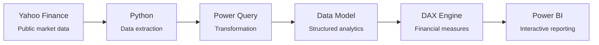

# Investment Analytics Platform

**An end-to-end financial analytics project** — transforming public market data into interactive insights for performance analysis, security comparison, risk, benchmark evaluation, and corporate events.

[](https://sotheangoun-lab.github.io/Investment-Analytics-Platform/)


**[▶ View the live project page](https://sotheangoun-lab.github.io/Investment-Analytics-Platform/)** &nbsp;·&nbsp; **[Watch the dashboard demo video](demo-video.mp4)**

---

## Overview

Financial markets generate large volumes of historical price, trading, and corporate-event data. This project transforms that raw information into a structured analytical platform for exploring market and security-level performance.

The solution brings together historical prices, returns, trading volume, benchmark-relative performance, risk measures, dividends, stock splits, and corporate events within an interactive Power BI environment — covering the complete analytical lifecycle from data acquisition through modeling, DAX calculations, visualization, and decision support.

> **Data & access note:** This project uses publicly available market data from Yahoo Finance for analytical and portfolio demonstration purposes. The Power BI report itself is maintained in a private workspace, so this portfolio presents the dashboard through a walkthrough video rather than a public Power BI embed.

## Dashboard Pages

| # | Page | What it shows |
|---|------|----------------|
| 01 | **Market Overview** | Historical prices, returns, trading volume, and cross-security performance comparison with dynamic filters |
| 02 | **Security Analysis** | Security-level performance and risk analysis for deeper evaluation of individual securities |
| 03 | **Corporate Events** | Dividend activity, dividend growth, stock splits, and corporate-event history |

## Architecture



Data → Transformation → Modeling → Analytics → Visualization → Decision Support

## Analytical Capabilities

- **Performance** — historical prices, returns, growth, and benchmark-relative performance
- **Risk** — volatility, drawdown, beta, and risk-adjusted performance analysis
- **Benchmark** — security performance evaluated against benchmark and market measures
- **Corporate Events** — dividend history, dividend growth, stock splits, and event analysis

## Tech Stack

| Category | Tools |
|---|---|
| Business Intelligence | Power BI, DAX, Data Modeling, Interactive Reporting |
| Data Engineering | Python, Power Query, Data Transformation, Data Validation |
| Visualization | Deneb, Vega-Lite, Dashboard Design, Data Storytelling |
| Financial Analytics | Returns, Risk Analysis, Benchmarking, Corporate Events |

## Methodology

1. **Data Acquisition** — collect public historical market and corporate-event data
2. **Data Preparation** — clean, transform, and structure the data for analytical use
3. **Data Modeling** — build an analytical model supporting flexible filtering and calculations
4. **Analytical Layer** — develop DAX measures for performance, risk, and benchmark analysis
5. **Visualization** — design interactive Power BI views and custom Deneb/Vega-Lite visuals

## Repository Structure

```
├── index.html          # Portfolio/showcase page (GitHub Pages)
├── demo-video.mp4       # Dashboard walkthrough recording
├── README.md
└── LICENSE
```

## About the Author

Built by **Sothea Nguon** as an independent financial analytics project.

[](https://github.com/sotheangoun-lab)

## License

This project is licensed under the [MIT License](LICENSE). Market data sourced from Yahoo Finance is used for analytical and portfolio demonstration purposes only.
