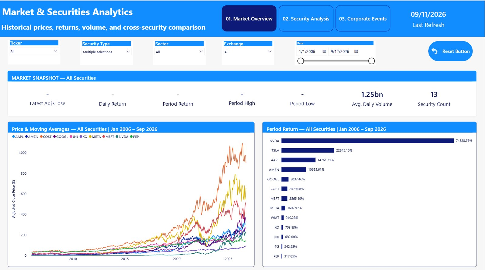
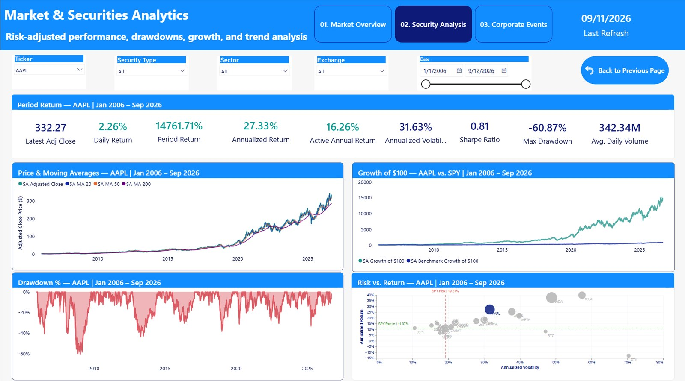
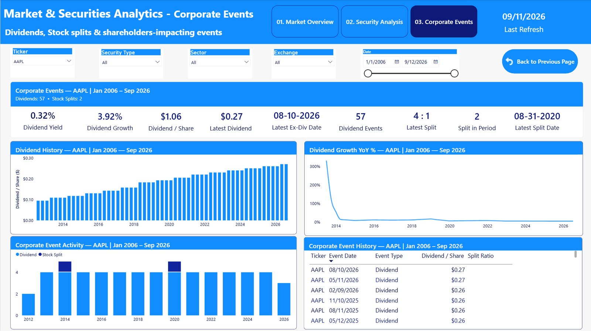
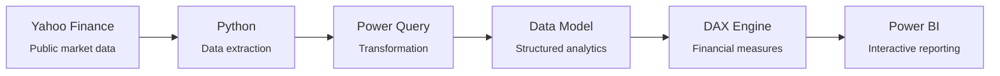

# Investment Analytics Platform

**A raw return tells you almost nothing on its own.** A security up 500% could have taken a far riskier path than one up 200% — this project pairs return with risk, benchmark context, and corporate actions so performance can be judged properly instead of at face value.

[](https://sotheangoun-lab.github.io/Investment-Analytics-Platform/)


**[▶ View the live project page](https://sotheangoun-lab.github.io/Investment-Analytics-Platform/)** &nbsp;·&nbsp; **[Watch the dashboard demo video](demo-video.mp4)**

<p align="center">
  
</p>

---

## Overview

Every investor eventually asks the same question: which holdings are actually earning their risk? A headline return doesn't answer that — it can't distinguish a steady compounder from a security that got lucky on a volatile ride. Answering it properly means pairing return with volatility, drawdown, and benchmark context, at the same time, for every security in the portfolio.

This project builds that analytical scaffolding from scratch: two decades of public price, volume, and corporate-event history for 13 securities spanning equities, ETFs, and crypto, modeled into a single Power BI environment where performance, risk, and benchmark comparisons update together as a user filters — from data acquisition through Power Query transformation, DAX-based modeling, and interactive visualization.

> **Data & access note:** This project uses publicly available market data from Yahoo Finance for analytical and portfolio demonstration purposes. The Power BI report itself is maintained in a private workspace, so this portfolio presents the dashboard through a walkthrough video and screenshots rather than a public Power BI embed.

## At a Glance

| Securities Tracked | Years of Market History | Top Security Return | Report Pages |
|---|---|---|---|
| 13 | 20 (2006–2026) | 74,829% (NVDA) | 3 |

## What the Data Reveals

A sample of what pairing return with risk, benchmark, and corporate-action context actually surfaces once the filters come off:

- **74,829% vs. 778%** — NVDA's total return vs. the S&P 500 (SPY) since 2006, roughly 96x the benchmark's gain over the same window.
- **0.81 Sharpe ratio** — AAPL's risk-adjusted score despite a 27.3% annualized return, once a -60.9% maximum drawdown is factored in.
- **3,431% vs. 554%** — a concentrated semiconductor ETF (SMH) vs. a diversified, dividend-focused one (SCHD) over the same 20 years.
- **57 dividends, 2 splits** — corporate actions modeled explicitly for AAPL alone, including a 4-for-1 split and 3.92% year-over-year dividend growth.

## Dashboard Pages

| # | Page | What it shows |
|---|------|----------------|
| 01 | **Market Overview** | Historical prices, returns, trading volume, and cross-security performance comparison with dynamic filters |
| 02 | **Security Analysis** | Security-level performance and risk analysis — Sharpe ratio, annualized volatility, drawdown, and growth vs. benchmark |
| 03 | **Corporate Events** | Dividend history, dividend growth, stock splits, and corporate-event history |

<table>
<tr>
<td width="33%"><br><sub align="center">01 · Market Overview</sub></td>
<td width="33%"><br><sub>02 · Security Analysis</sub></td>
<td width="33%"><br><sub>03 · Corporate Events</sub></td>
</tr>
</table>

## Architecture



Data → Transformation → Modeling → Analytics → Visualization → Decision Support

## Analytical Capabilities

- **Performance** — historical prices, returns, growth, and benchmark-relative performance
- **Risk** — volatility, drawdown, beta, and risk-adjusted performance analysis
- **Benchmark** — security performance evaluated against benchmark and market measures
- **Corporate Events** — dividend history, dividend growth, stock splits, and event analysis

## Notable Technical Challenges

- **Mixed-calendar assets** — the model spans equities/ETFs (weekday market calendar) alongside BTC/ETH (trading every day of the year). Time-intelligence DAX measures normalize across trading calendars before computing returns and volatility, so a crypto asset and an equity ETF can sit on the same comparison chart without the comparison being misleading.
- **Return vs. risk-adjusted truth** — a raw return ranking and a risk-adjusted view (Sharpe ratio, volatility, drawdown) can rank the same securities in a different order. Rather than pick one framing, the dashboard keeps both visible side by side.

## Tech Stack

| Category | Tools |
|---|---|
| Business Intelligence | Power BI, DAX, Data Modeling, Interactive Reporting |
| Data Engineering | Python, Power Query, Data Transformation, Data Validation |
| Visualization | Deneb, Vega-Lite, Dashboard Design, Data Storytelling |
| Financial Analytics | Returns, Risk Analysis, Benchmarking, Corporate Events |

## Methodology

1. **Data Acquisition** — collect public historical market and corporate-event data
2. **Data Preparation** — clean, transform, and structure the data for analytical use
3. **Data Modeling** — build an analytical model supporting flexible filtering and calculations
4. **Analytical Layer** — develop DAX measures for performance, risk, and benchmark analysis
5. **Visualization** — design interactive Power BI views and custom Deneb/Vega-Lite visuals

## Repository Structure

```
├── index.html                       # Portfolio/showcase page (GitHub Pages)
├── demo-video.mp4                   # Dashboard walkthrough recording
├── assets/
│   ├── screenshots/                 # Real report-page screenshots
│   ├── favicon.ico, og-image.png    # Site icon & social-preview image
├── README.md
└── LICENSE
```

## About the Author

Built by **Sothea Nguon** as an independent financial analytics project.

[](https://github.com/sotheangoun-lab)

## License

This project is licensed under the [MIT License](LICENSE). Market data sourced from Yahoo Finance is used for analytical and portfolio demonstration purposes only.
